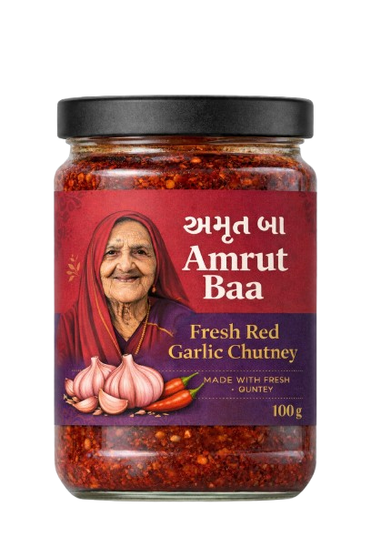

# Quick Reference - Amrut Baa Website

## 📂 File Structure

```
Amrutbaa.com/
├── index.html              # Main page (all sections)
├── manifest.json           # PWA configuration
├── robots.txt              # Search engine instructions
├── sitemap.xml             # SEO sitemap
├── README.md               # Project documentation
├── DEPLOYMENT.md           # Deployment guide
├── styles/
│   └── main.css           # All styles (880+ lines)
├── scripts/
│   └── main.js            # All JavaScript (400+ lines)
└── assets/
    └── images/
        ├── product-jar.png      # Main product image
        └── product-pouch.png    # (Removed from UI; bottles only)
```

## 🎨 Color Variables

```css
--maroon: #6B1C23           /* Primary brand color */
--deep-maroon: #4D0E13      /* Dark accent */
--dark-purple: #3D1F47      /* Secondary color */
--golden: #C9A961           /* Accent/highlights */
--cream: #FAF7F2            /* Background */
--warm-white: #FFFCF7       /* Light background */
--charcoal: #2B2B2B         /* Dark text */
```

## 🔧 Common Edits

### Update Batch Dates

**File**: `index.html` (line ~214)
```html
<div class="batch-detail">
    <span class="detail-label">Next Preparation Date</span>
    <span class="detail-value">January 5, 2026</span> <!-- CHANGE THIS -->
</div>
```

### Change Available Slots

**File**: `scripts/main.js` (line ~320)
```javascript
const currentSlots = 50; // CHANGE THIS NUMBER
```

### Update Contact Information

**File**: `index.html` (line ~300)
```html
<p>Email: info@amrutbaa.com</p>      <!-- CHANGE EMAIL -->
<p>Phone: +91 XXXXX XXXXX</p>         <!-- CHANGE PHONE -->
```

### Modify Pricing (when ready)

Add pricing section in `index.html` after product section:
```html
<section class="pricing">
    <div class="container">
        <h2>Simple, Transparent Pricing</h2>
        <div class="price-card">
            <h3>₹150</h3>
            <p>per 100g jar</p>
        </div>
    </div>
</section>
```

## 🚀 Development Commands

```bash
# Start local server
python3 -m http.server 8000

# View in browser
open http://localhost:8000

# Check for errors
# Open browser console (F12)
```

## 📝 Content Updates

### Hero Section
- **Location**: `index.html` lines 35-60
- **Elements**: Title, subtitle, description, CTA buttons

### Story Section
- **Location**: `index.html` lines 62-95
- **Elements**: 3 story cards (heritage, grandmother, love)

### Product Section
- **Location**: `index.html` lines 97-150
- **Elements**: Ingredients list, highlights, product info

### Batch System
- **Location**: `index.html` lines 152-195
- **Elements**: 3 steps, notice box

### Order Form
- **Location**: `index.html` lines 197-280
- **Elements**: Registration form, batch info

## 🎭 Animations Reference

### CSS Animations
```css
fadeInUp          /* Sections fade in on scroll */
float             /* Product image floating */
shimmer           /* Highlight shimmer effect */
pulse             /* Badge pulsing */
spin              /* Loading spinner */
slideInLeft       /* Ingredient items slide in */
```

### JavaScript Animations
- Scroll-based fade-ins
- Parallax effects on hero
- Navbar hide on mobile scroll down
- Form field validation animations
- Success popup modal
- Toast notifications

## 🔍 SEO Elements

### Meta Tags (in `<head>`)
```html
<meta name="description" content="...">
<meta property="og:title" content="...">
<meta property="og:description" content="...">
<meta property="og:image" content="...">
<meta name="theme-color" content="#6B1C23">
```

### Structured Data (to add)
```html
<script type="application/ld+json">
{
  "@context": "https://schema.org",
  "@type": "FoodEstablishment",
  "name": "Amrut Baa",
  ...
}
</script>
```

## 🐛 Common Issues & Fixes

### Issue: Form not submitting
**Fix**: Check browser console, verify form IDs match JavaScript

### Issue: Images not showing
**Fix**: Check file paths are correct (case-sensitive on Linux)
```html
<!-- Wrong -->


<!-- Correct -->

```

### Issue: Animations not working
**Fix**: User may have reduced motion enabled
```css
@media (prefers-reduced-motion: reduce) {
    /* Animations disabled */
}
```

### Issue: Mobile layout broken
**Fix**: Clear cache, check responsive CSS is not overridden

## 📊 Performance Targets

| Metric | Target | Current |
|--------|--------|---------|
| First Contentful Paint | <1.8s | ✅ |
| Largest Contentful Paint | <2.5s | ✅ |
| Total Blocking Time | <200ms | ✅ |
| Cumulative Layout Shift | <0.1 | ✅ |
| Speed Index | <3.4s | ✅ |

## 🔐 Security Headers (add to Cloudflare)

```
X-Frame-Options: DENY
X-Content-Type-Options: nosniff
Referrer-Policy: strict-origin-when-cross-origin
Permissions-Policy: camera=(), microphone=(), geolocation=()
```

## 📱 Testing Checklist

- [ ] Test on Chrome desktop
- [ ] Test on Firefox desktop
- [ ] Test on Safari desktop
- [ ] Test on iPhone Safari
- [ ] Test on Android Chrome
- [ ] Test form submission
- [ ] Test all navigation links
- [ ] Check responsive breakpoints
- [ ] Verify images load
- [ ] Check loading screen
- [ ] Test success popup
- [ ] Verify smooth scrolling

## 🎯 Conversion Optimization

### A/B Test Ideas
1. CTA button text: "Register Now" vs "Reserve Your Spot"
2. Hero image: Jar only (no pouch)
3. Testimonials: With photos vs Without
4. Form length: Short (3 fields) vs Current (7 fields)

### Heatmap Tools (Optional)
- Hotjar (free tier)
- Microsoft Clarity (free)
- Crazy Egg (paid)

## 📞 Contact Form Fields

| Field | Type | Required | Validation |
|-------|------|----------|------------|
| Name | Text | Yes | Min 2 characters |
| Phone | Tel | Yes | Exactly 10 digits |
| Email | Email | No | Valid email format |
| Address | Textarea | Yes | Min 10 characters |
| Quantity | Select | Yes | 1-5 jars |
| Packaging | Select | No | Jar only |
| Terms | Checkbox | Yes | Must accept |

## 🎨 Typography Scale

```css
Hero Title:     4.5rem / 72px
Section Titles: 3rem / 48px
Subheadings:    1.8rem / 28.8px
Body Text:      1rem / 16px
Small Text:     0.85rem / 13.6px
Tiny Text:      0.75rem / 12px
```

## 🌐 Browser Support Matrix

| Browser | Version | Support |
|---------|---------|---------|
| Chrome | 90+ | ✅ Full |
| Firefox | 88+ | ✅ Full |
| Safari | 14+ | ✅ Full |
| Edge | 90+ | ✅ Full |
| IE11 | - | ❌ Not supported |

## 🔄 Update Workflow

```bash
# 1. Make changes locally
# 2. Test in browser
# 3. Commit changes
git add .
git commit -m "Description of changes"

# 4. Push to GitHub
git push origin main

# 5. Cloudflare auto-deploys
# Wait 1-2 minutes, site is live!
```

## 💡 Future Feature Ideas

### Phase 2 (Short-term)
- Add WhatsApp chat button
- Implement real batch counter (API)
- Add customer testimonials carousel
- Create "How to Use" video section

### Phase 3 (Medium-term)
- Blog for recipes and stories
- Multiple product variants
- Payment integration
- Order tracking system

### Phase 4 (Long-term)
- Customer accounts/login
- Subscription model
- Referral program
- Mobile app (React Native)

## 📚 Resources

- [HTML Documentation](https://developer.mozilla.org/en-US/docs/Web/HTML)
- [CSS Documentation](https://developer.mozilla.org/en-US/docs/Web/CSS)
- [JavaScript Documentation](https://developer.mozilla.org/en-US/docs/Web/JavaScript)
- [Cloudflare Pages Docs](https://developers.cloudflare.com/pages/)
- [Web Performance Guide](https://web.dev/performance/)

## 🆘 Emergency Contacts

- **Cloudflare Support**: support@cloudflare.com
- **GitHub Support**: support@github.com
- **Domain Registrar**: (your registrar)

---

**Last Updated**: January 18, 2026
**Version**: 1.0.0
